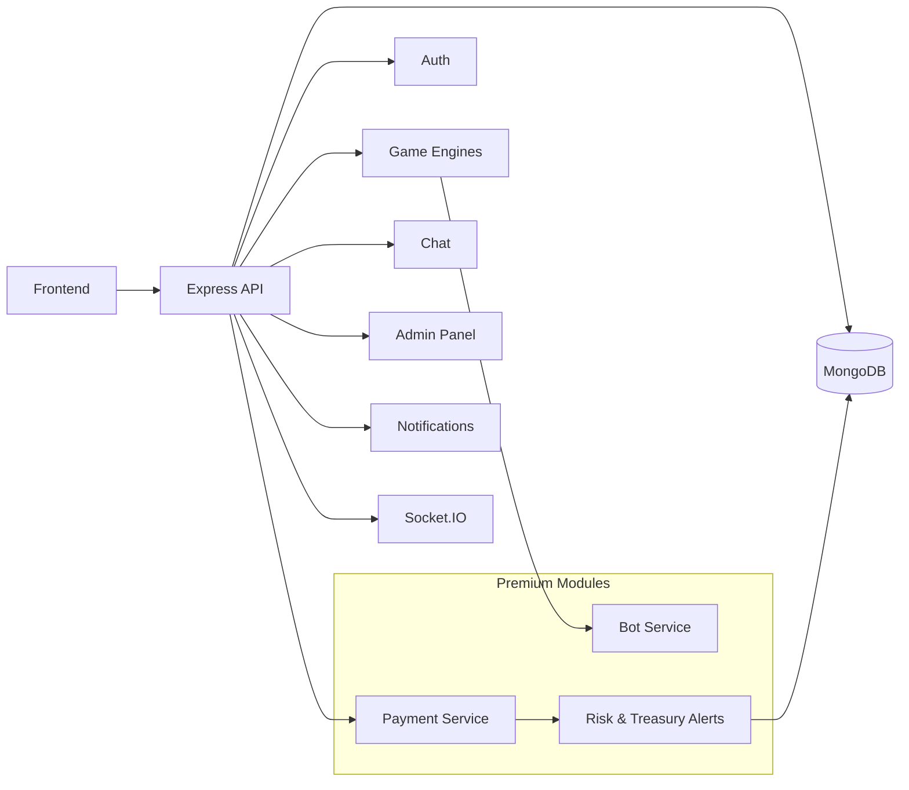

## Overview

This backend powers a modern crypto-enabled betting platform.  
It is designed for **fast gameplay**, **real-time community**, and **serious risk control** – without sacrificing developer friendliness.

You get a clean, shareable core that you can run locally in a few minutes, and a clear upgrade path to premium features like **on‑chain payments**, **automated bots**, and advanced **risk alerts**.

**Shared build note:** This repository is the **public core** – the **payment** and **bot service** modules are premium and are intentionally removed from this code. The architecture diagram below still shows them so you can see the *full* vision of the platform.

## How it works – high level

- **API layer**: Express.js REST API exposes authentication, user profiles, games, history, and admin tools.
- **Real-time engine**: Socket.IO channels keep games, chat, and dashboards live and reactive.
- **Game engines (private)**: Crash, Mine, Roulette, and Coinflip are hosted in the private/premium backend. In this shared public build, the game HTTP endpoints and game Socket.IO handlers are intentionally disabled.
- **Data layer**: MongoDB stores users, balances, bets, history, notifications, and configuration.
- **Auth & security**: JWT-based auth, wallet signatures, rate limiting, and strict validation.
- **Email & notifications**: EmailJS and in-app notifications keep users and admins informed.
- **Premium (not in this repo)**: Blockchain payments, deposit/withdrawal tracking, and autonomous bot players.

## System diagram (full vision, including premium modules)



- **In this shared backend** you get everything in the **Backend** box plus MongoDB, EmailJS, and Socket.IO.
- **In the premium/private layer** you connect your own payment providers, bot engine, and risk controls – the diagram shows where they plug in.

## Tech stack

- **Runtime**: Node.js
- **Framework**: Express.js
- **Database**: MongoDB + Mongoose
- **Real-time**: Socket.IO
- **Authentication**: JWT + wallet signatures + optional Supabase integration
- **Email**: EmailJS
- **Security**: Helmet, CORS, rate limiting

## Prerequisites

- Node.js (v16 or higher)
- MongoDB (local or cloud, e.g. `mongodb://localhost:27017/your_db_name`)

## How to run (standalone)

- **1. Install dependencies**

  ```bash
  npm install
  ```

- **2. Configure environment**

  ```bash
  cp env.example .env
  ```

  **Minimum for local dev**

  - `MONGODB_URI` – your Mongo connection string (local is fine).
  - `FRONTEND_URL` – frontend origin for CORS (e.g. `http://localhost:3000`).
  - Optionally set `JWT_SECRET` in your real `.env` (not in `env.example`) for stronger tokens.

  **No payment or bot variables are required in this shared build.**

- **3. Start the server**

  ```bash
  npm start
  ```

  Important: this shared/public version commits the compiled output in `build/`, but the premium/private game engine TypeScript source in `src/` may be missing.
  That means **guests should use `npm start` only**.
  - `npm run dev` may fail for guests.
  - `npm run build` may also fail if the missing TypeScript source isn’t present.

  If you are the maintainer and have the full source available, you can still use `npm run dev` locally.

  The server listens over **HTTP** (no HTTPS in this shared build).  
  Default port is taken from `PORT` in `.env` (e.g. `3001`).

- **4. Smoke test**

  - Open `http://localhost:3001/health`
  - You should see a JSON object like:

    ```json
    { "status": "OK", "timestamp": "..." }
    ```

At this point the backend is alive, connected to MongoDB, and ready to be wired to your frontend.

## Environment configuration

Below is a quick reference for the main variables used in this shared backend. All values in `env.example` are **placeholders** – never commit your real secrets.

### Core

- **`MONGODB_URI`** (required): MongoDB connection string.
- **`PORT`** (optional, default `3001`): HTTP port for the API.
- **`NODE_ENV`** (optional): `development` or `production`.
- **`FRONTEND_URL`** (recommended): Main frontend origin for CORS.
- **`ADMIN_FRONTEND_URL`** (optional): Admin panel origin for CORS.
- **`ALLOWED_ORIGINS`** (optional): Extra comma-separated origins for CORS.

### Auth & security

- **`JWT_SECRET`** (strongly recommended in private builds): Secret used to sign JWTs (fallback dev secret exists, but do **not** use it in production).
- **Rate limiting**:
  - `RATE_LIMIT_WINDOW_MS`
  - `RATE_LIMIT_MAX_REQUESTS`
  - `AUTH_RATE_LIMIT_WINDOW_MS`
  - `AUTH_RATE_LIMIT_MAX_REQUESTS`

### Email & app identity

- **`EMAILJS_SERVICE_ID`**, `EMAILJS_PUBLIC_KEY`, `EMAILJS_PRIVATE_KEY`
- **`EMAILJS_OTP_TEMPLATE_ID`**, `EMAILJS_VERIFICATION_TEMPLATE_ID`, `EMAILJS_WELCOME_TEMPLATE_ID`
- **`APP_NAME`** – displayed in emails and UI text.

If these are not set, email-related features will simply log warnings and skip sending.

### Supabase (optional integration)

- **`SUPABASE_URL`**, `SUPABASE_ANON_KEY`, `SUPABASE_SERVICE_ROLE_KEY`

Used by the `supabaseAuth` middleware. If you do not use Supabase, you can leave these empty and avoid that middleware.

### Solana & treasury (private builds)

- **`NETWORK`** – e.g. `devnet`
- **`TREASURY`** – Solana private key (base58) used for treasury operations

In the **full private backend**, this is highly sensitive and must never appear in public repos or `env.example` with real values.

### Logging & alerts

- `MB_LOG_LEVEL`, `MB_LOG_MAX_FILES`, `MB_LOG_FLUSH_MS`
- `MB_LOG_HOOK_LEVEL`
- `SLACK_WEBHOOK_URL`
- `TELEGRAM_BOT_TOKEN`, `TELEGRAM_CHAT_ID`
- `DISCORD_WEBHOOK_URL`

These control structured logging and optional alert hooks for production monitoring.

### Admin bootstrap

- **`ADMIN_BOOTSTRAP_TOKEN`** – one-time token used by the bootstrap script to create the first admin.
- `ADMIN_EMAIL`, `ADMIN_USERNAME`, `ADMIN_DISPLAY_NAME` – defaults for that bootstrap user.

In a real deployment, treat `ADMIN_BOOTSTRAP_TOKEN` like a password and rotate it after use.

## Premium modules (not included in this repo)

To keep this repository safe to share and easy to run locally, the following modules are **not** part of the public codebase but are shown in the diagram so you can imagine the full experience:

- **Payment module**
  - Crypto gateways, webhooks, deposit/withdrawal tracking.
  - Advanced reconciliation, on-chain transaction mapping, and chargeback protection.
  - Backed by secrets like `NOWPAYMENTS_*`, `CRYPTOPAY_*`, and RSA keys – these stay entirely in your private build.

- **Bot service**
  - Configurable automated players to simulate traffic, fill lobbies, and stress-test your game engines.
  - Smart strategies per game (crash, roulette, coinflip, etc.).
  - Fully detached from the shared build so you can safely demo the core engine without synthetic traffic.

Those pieces are where you plug in your own business logic, KYC/AML policies, treasury strategy, and payment providers – the **heart** of your platform stays private, while this repo gives you a solid, auditable core to build on.

## What to keep secret (full / private build)

If you maintain a full/private version of this backend, keep these out of public repos and sample envs:

- **Secrets:** `JWT_SECRET`, `ADMIN_BOOTSTRAP_TOKEN`, `TREASURY`, Supabase service role key, any payment API keys (`NOWPAYMENTS_*`, `CRYPTOPAY_*`, etc.), EmailJS private key, bot-related keys.
- **Sensitive config:** Production `MONGODB_URI`, production domains/URLs, internal admin URLs, webhook secrets.

The shared build does **not** require any payment or bot secrets to run.

## License

MIT License – see `LICENSE` for details.

## Support

If you build something with this, or want to extend it with premium modules, feel free to reach out or open an issue. Building gaming platforms is hard – this backend is here to make it feel exciting instead of scary.
